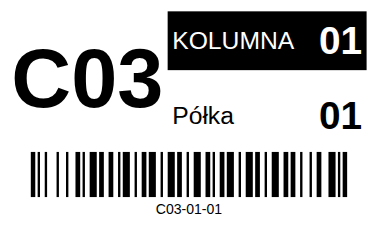

# Etykieciarka 🏷️

Aplikacja webowa do projektowania **etykiet lokalizacyjnych na regały magazynowe** (regał / kolumna / półka + kod kreskowy Code128), drukowanych na drukarkach termicznych **Zebra ZD421**.



## Funkcje

- **Podgląd WYSIWYG** — etykieta rysowana w milimetrach (SVG), dokładnie tak, jak zostanie wydrukowana: duży kod regału, pasek „KOLUMNA" w negatywie, wiersz „Półka", kod kreskowy Code128 z tekstem.
- **Konfigurowalny rozmiar** — presety 100×60, 100×50, 57×32 mm lub dowolne wymiary; rozdzielczość 203/300 dpi.
- **Projektowanie układu** — skalowanie czcionek, włączanie/wyłączanie elementów, własne teksty nagłówków i szablon kodu (`{regal}-{kolumna}-{polka}`).
- **Serie etykiet** — zakresy kolumn i półek (oraz wiele regałów po przecinku) generują wszystkie kombinacje do wydruku hurtowego.
- **Druk z przeglądarki** — każda etykieta to osobna strona o dokładnym rozmiarze etykiety (`@page`), do druku przez sterownik Windows drukarki Zebra.
- **Eksport ZPL** — natywny kod ZPL (`^BC` Code128, `^GB`+`^FR` negatyw, `^CI28` UTF-8) do pobrania lub skopiowania, do wysłania bezpośrednio do drukarki.
- **Zapamiętywanie ustawień** — stan aplikacji zapisywany w `localStorage`.

## Uruchomienie

```bash
npm install
npm run dev      # serwer deweloperski
npm run build    # build produkcyjny do dist/
npm test         # testy (vitest)
```

Aplikacja jest w pełni statyczna (bez backendu) — zawartość `dist/` można hostować na dowolnym serwerze statycznym (GitHub Pages, itp.).

## Jak drukować

### Druk z przeglądarki (zalecane)

1. Zainstaluj sterownik Zebra ZD421 (Windows) i ustaw w nim rozmiar etykiety taki sam jak w aplikacji.
2. W aplikacji kliknij **Drukuj** — otworzy się okno drukowania.
3. Wybierz drukarkę Zebra, ustaw **skalę 100%** (bez dopasowania do strony) i **marginesy 0**.

### Plik ZPL (dla zaawansowanych)

Przycisk **Pobierz .zpl** zapisuje surowy kod ZPL. Można go wysłać do drukarki np.:

- po sieci: `nc <ip-drukarki> 9100 < etykiety.zpl` (albo narzędziem Zebra Setup Utilities),
- przez USB: „drukując" plik na udostępnioną drukarkę RAW.

Kod ZPL można też podejrzeć na [labelary.com](https://labelary.com/viewer.html) (ZPL Viewer).

Domyślnie ZPL używa UTF-8 (`^CI28`) — polskie znaki („Półka") drukują się poprawnie na firmware Link-OS drukarki ZD421. Gdyby drukarka drukowała krzaczki, zaznacz w ustawieniach **„Zamień polskie znaki w ZPL"**.

## Stos technologiczny

React 19 + TypeScript + Vite, [bwip-js](https://github.com/metafloor/bwip-js) do renderowania kodu kreskowego w podglądzie. Geometria etykiety liczona jest w jednym miejscu (`src/lib/layout.ts`) w milimetrach i współdzielona przez podgląd SVG, druk z przeglądarki i generator ZPL (`src/lib/zpl.ts`).
